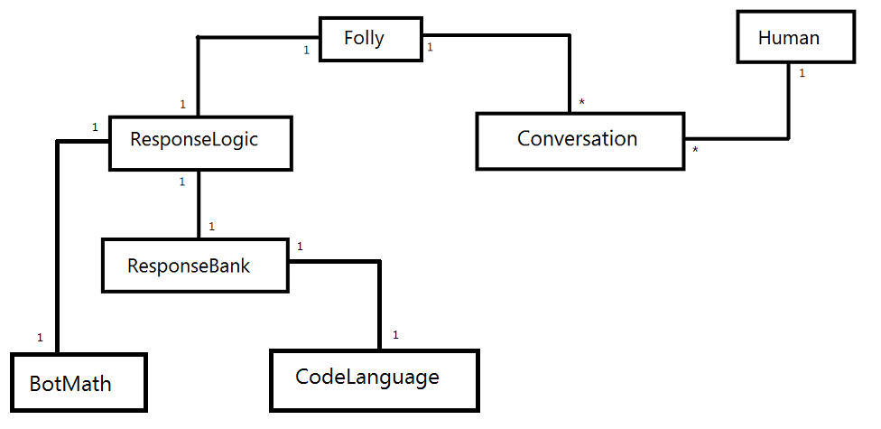
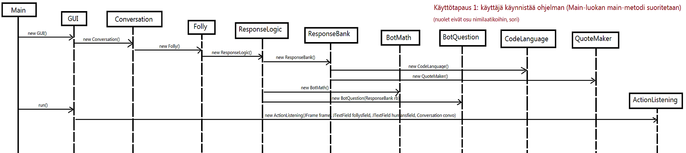
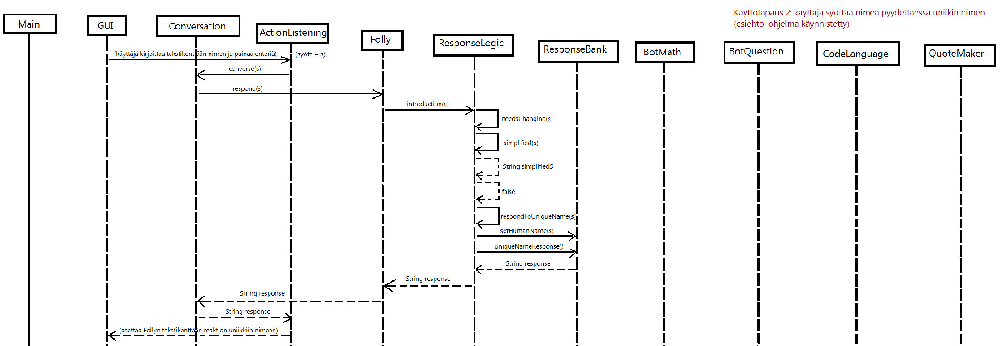
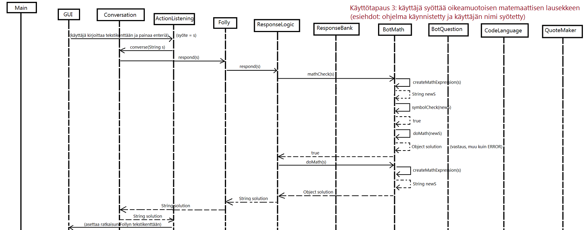

**Aihe:** Oraakkelibotti, joka osaa vastata kysymyksiin, laskea matematiikkaa, antaa hyödyllisiä ohjeita ja jotain. "Folly" on eräs punertava värisävy. Sille on myös suomenkielinen vastine, nimittäin "typeryys".

**Käyttäjät:** Yksi tylsistynyt, mutta helposti viihdytettävä ihminen.

**Kaikkien käyttäjien toiminnot:**

* Syötä nimesi ja koe läheisyyden tunne kun botti puhuttelee sinua sillä, paitsi jos syötät botin nimen
  * Hyvin älykäs botti huomaa erikoismerkeilläkin naamioidun, mutta muuten samankaltaisen nimen.
* Kysy kyllä tai ei-kysymys
  * Kysymysmerkki on olennainen. Kysymyslause loppuu kysymysmerkkiin. Jos et osaa näitä juttuja, botti päättää jättää vastaamatta.
  * Ensimmäinen saamasi vastaus on lopullinen vastaus. Kokeile vaikka kysyä samaa uudestaan, ja tulet huomaamaan sen. Jos et pidä vastauksesta, voit tietenkin koittaa esittää saman kysymyksen eri muodossa, jos vaikka kuulisit haluamasi. Botti uskoo monien täysin samaa kysyviltä vaikuttavien kysymysten olevan hieman erilaisia, mutta toisaalta se myös valehtelee paljon.
  * Botti ei pidä kysymyksistä, joihin ei voi vastata kyllä tai ei, mutta voit koittaa kysyä niitäkin.
* Anna matemaattinen lauseke
  * Voi käyttää plus-, miinus-, kerto- ja jakomerkkejä sekä sulkuja [eli +, -, *, /, (, )]. Desimaalilukujen merkitsemisessä voi käyttää joko pistettä tai pilkkua. Älä jaa nollalla. Tai jaa. Ihan sama.
* Sano jotain, oikeastaan ihan mitä vain
  * Botista ei ole syvälliseen keskusteluun, mutta saatat saada vastaukseksi hyviä elämänohjeita. Älä kuitenkaan noudata niitä kaikkia.
* Sano "bye" (tai vaikka "BYE!!!!!!!!11") niin botti hyvästelee, ja sulkee ohjelman painettuasi enteriä

Ohjelma käynnistetään Main-luokan main-metodilla, joka kutsuu uuden GUI-olion run-metodia. Uuden GUIn kutsuminen luo instanssin ohjelman muista luokista seuraavassa järjestyksessä: Conversation, Folly, ResponseLogic, ResponseBank, CodeLanguage, QuoteMaker, BotMath, BotQuestion, QuestionTracker. Jäljelle jää ActionListening, joka alustetaan vasta run-metodin suorituksen yhteydessä. Kahden luokan välinen yhteys on aina yksi-yhteen-yhteys, eli mistään luokasta ei esimerkiksi luoda useampaa instanssia.

Conversation on luokka, joka ikään kuin yhdistää ohjelman graafisen käyttöliittymän ja logiikkapuolen, joka liittyy Follyyn. GUI ja ActionListening ovat molemmat yhteydessä Conversation-luokkaan, kuten on myös Folly, johon yhdistyy ResponseLogic-luokan kautta useita muita luokkia, jotka auttavat käyttäjän syötteen analysoimisessa ja sopivan vastauksen antamisessa. Conversation siis välittää tämän vastauksen graafiselle puolelle.

**Sekvenssikaavioita käyttötapauksista:**

Huom. sekvenssikaavioihin kuuluu nykyään myös QuestionTracker-luokka BotQuestionin ja CodeLanguagen väliin, mutta seuraavissa käyttötapauksissa sitä ei käytetä.

